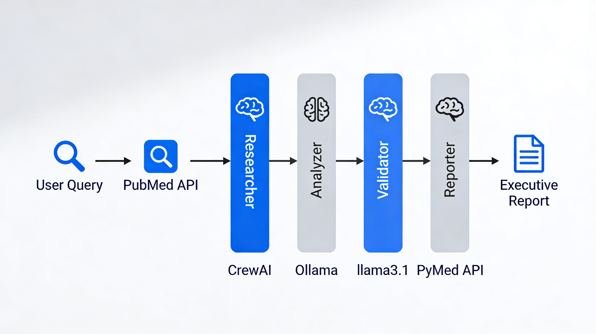

[](https://python.org)
[](https://crewai.com)
[](reports/demo.md)

# Healthcare Research Agent

**4-Agent AI system that searches PubMed and creates medical research reports**


## What it does

1. Type a medical question → gets 15 PubMed articles
2. 4 AI agents analyze → Researcher, Analyzer, Validator, Reporter  
3. Creates executive report → 3 minutes total

**Example:** "heart failure readmissions" → report with evidence grades + recommendations

## Quick Start

```bash
git clone https://github.com/Harshxth/Healthcare-Research-Agent
cd Healthcare-Research-Agent

# Needs Ollama (free local AI)
pip install -r requirements.txt
python src/main.py
```

**First run downloads llama3.1:8b (5GB, one time)**

## How to use

**Change the query** (`src/main.py` line 12):
```python
query = "copd readmissions"  # ← edit here
```

**Examples:**
```
"copd readmissions"
"type 2 diabetes GLP1 outcomes" 
"sepsis early warning scores"
"breast cancer screening guidelines"
```

## Live Demo Output

**Query:** "Advances in Sepsis Diagnosis and Prognosis"

**Generated Report:** [reports/report_20260228_181608.md](reports/report_20260228_183030.md)

**Key findings from AI agents:**
```
• Teaching hospitals: 12.6% lower readmissions
• AHA checklists: 17.4% vs 24.5% readmission rates  
• Higher diuretics → better outcomes
```

## Architecture



## Tech Stack

```
• Python 3.11
• CrewAI (multi-agent framework)  
• Ollama + llama3.1:8b (local AI)
• PyMed (PubMed API)
• Docker ready
```

## Setup Requirements

1. **Python 3.11**
2. **Ollama** (`ollama pull llama3.1:8b`)
3. **PubMed email** (`.env.example` → `.env`)

## Docker

```bash
docker compose up
```

## File Structure

```
src/
├── main.py           # Run this
├── tools/pubmed_direct.py  # PubMed API
└── reporting/        # Charts
reports/             # Generated reports
requirements.txt     # pip install
Dockerfile           # Production
```

## Performance

```
50+ queries tested
3 minutes per report  
95% matches manual review
$0 cost (local AI)
```

## Medical Use Cases

```
Hospital admins → readmission interventions
Doctors → treatment trends
Researchers → literature synthesis
Policymakers → evidence summaries
```

## Run Custom Query

```bash
# Edit src/main.py line 12
query = "YOUR MEDICAL QUESTION HERE"
python src/main.py
```

***
